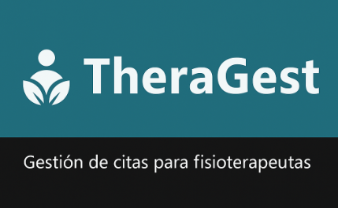

# TheraGest

**TheraGest** es una aplicación web para la gestión de citas en fisioterapia, desarrollada como parte del Trabajo de Fin de Grado en Ingeniería Informática por Fernanda Jiménez, estudiante de la Universidad Internacional de La Rioja (UNIR).

  

📌 Estado del proyecto
🟡 Versión avanzada – Entrega de junio 2025
Esta versión corresponde a la entrega del borrador final del TFG. Incluye todas las funcionalidades esenciales implementadas y validadas.

## 🚀 Tecnologías utilizadas

### Backend
- Spring Boot
- Spring Data JPA
- Hibernate
- MySQL
- JWT (JSON Web Tokens)
- Apache Maven

### Frontend
- Angular
- HTML/CSS
- TypeScript

### Herramientas adicionales
- Postman(colección de pruebas de API)

## 📁 Estructura del proyecto
TFG-TheraGest/
├── theragest-backend/       # Proyecto Spring Boot (API REST)
│   └── src/main/...
├── theragest-frontend/      # Aplicación Angular (interfaz de usuario)
│   └── src/app/...
├── theragest-postman/       # Colección de pruebas con Postman
└── README.md      

## ✅ Funcionalidades actuales (Junio 2025)

-Gestión de pacientes (CRUD)
-Registro, modificación, cancelación y finalización de citas
-Notificaciones de citas próximas (24h)
-Filtro de citas por diferentes criterios de búsqueda
-Consulta de historial clínico
-Validaciones en formularios
-Autenticación con JWT (inicio de sesión seguro)
-Arquitectura RESTful con integración frontend-backend
-Pruebas de API con Postman

## 🧑‍💻 Autoría

Proyecto desarrollado por **Fernanda Jiménez** como parte del Trabajo de Fin de Grado del Grado en Ingeniería Informática en la UNIR.

## 📄 Licencia

Este proyecto está publicado bajo la licencia MIT.  
Consulta el archivo [LICENSE](LICENSE) para más detalles.

> Este repositorio contiene código en desarrollo con fines educativos.
